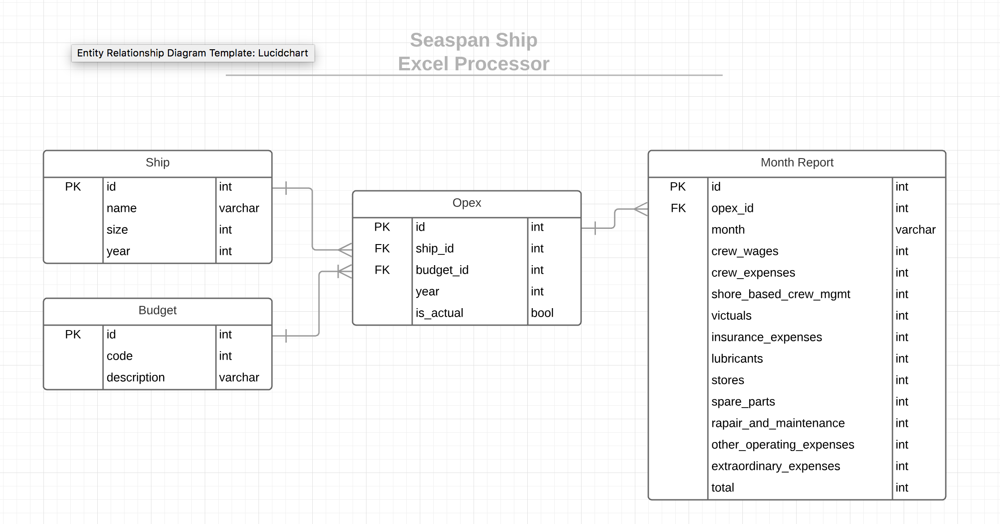

# Excel Processor

Containerized go web server that processes an excel file(s) into a database.

## Requirements:

- Simple front-end with a drop-zone or file upload component
- Tests
- Readme
- Docker file and/or docker compose

## Extra credit:

- Process a zip file of excel files

## ERD

